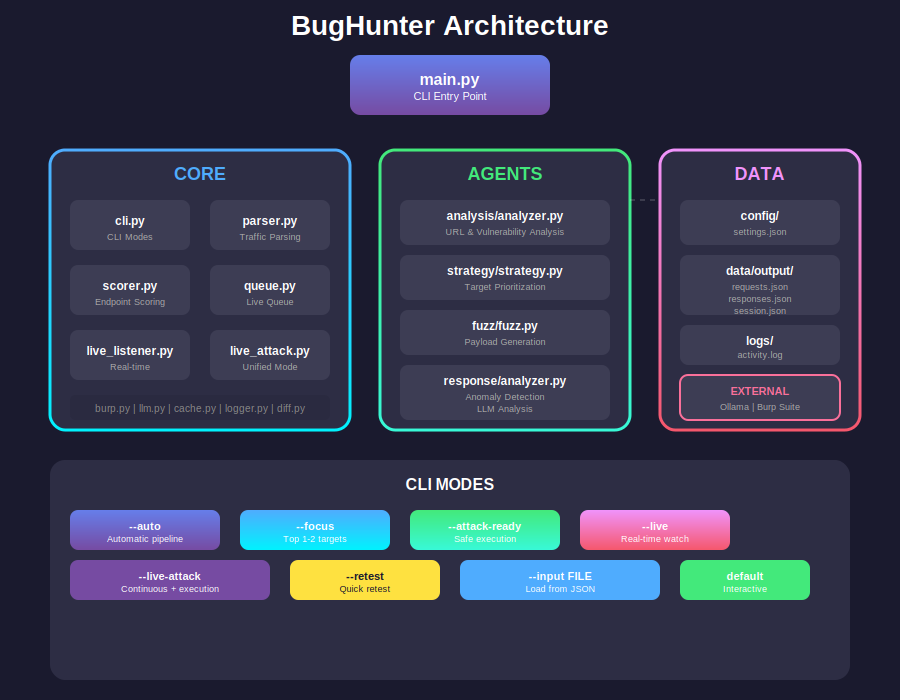
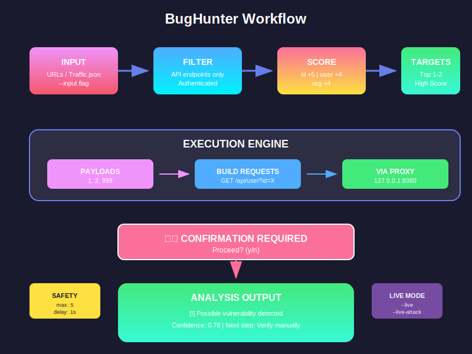
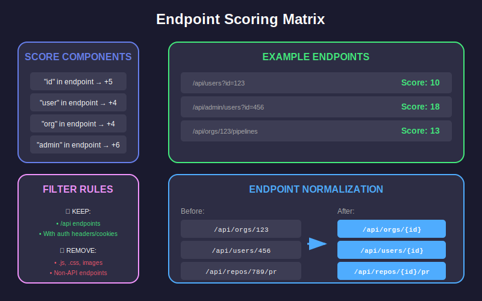

# BugHunter

[](https://opensource.org/licenses/MIT)
[](https://www.python.org/downloads/)
[](https://github.com/psf/black)

**AI-Assisted Security Testing Framework**

BugHunter is a powerful CLI tool for security researchers and bug bounty hunters. It automates the tedious process of identifying, prioritizing, and testing potential vulnerabilities in web applications.

## 🚀 Features

| Feature | Description |
|---------|-------------|
| **Smart Analysis** | Automatically analyzes URLs and identifies potential vulnerability patterns |
| **IDOR Detection** | Multi-user testing with session comparison for Insecure Direct Object Reference vulnerabilities |
| **Payload Generation** | Intelligent fuzzing payloads for IDOR, XSS, SQLI, AUTH, and RCE testing |
| **Safe Execution** | Confirmation prompts and rate limiting to prevent accidental damage |
| **Burp Integration** | Seamless proxy integration for capturing and replaying requests |
| **LLM Enhancement** | Optional Ollama integration for intelligent analysis |
| **Low RAM Mode** | Optimized for resource-constrained environments |
| **Session Management** | Multi-user session storage and comparison |
| **Report Generation** | Export findings in JSON or Markdown format |
| **Live Monitoring** | Real-time proxy traffic analysis |
| **Live-Attack Mode** | Continuous monitoring with attack execution |

## 📊 Architecture



## ⚡ Workflow



## 📈 Scoring System



## 📦 Installation

### Prerequisites

- Python 3.10 or higher
- [Ollama](https://ollama.ai/) (optional, for LLM analysis)
- [Burp Suite](https://portswigger.net/burp) (optional, for proxy testing)

### Quick Install

```bash
# Clone the repository
git clone https://github.com/Adarsh1Y/bughunter.git
cd bughunter

# Install dependencies
pip install -e .

# Or use uv for faster installation
uv pip install -e .
```

### Development Install

```bash
git clone https://github.com/Adarsh1Y/bughunter.git
cd bughunter
pip install -e ".[dev]"
```

## 🖥️ Usage

### Interactive Mode

```bash
python main.py
```

### Auto Mode (Recommended)

```bash
# Analyze single URL
python main.py --auto --urls https://target.com/api/users?id=1

# Analyze multiple URLs
python main.py --auto --urls https://target.com/api/users?id=1 https://target.com/api/orders?id=123
```

### Live Mode (Real-time Monitoring)

```bash
# Watch proxy traffic in real-time
python main.py --live
```

### Live-Attack Mode (Continuous + Execution)

```bash
# Continuous monitoring with attack execution
python main.py --live-attack
```

### Attack-Ready Mode

```bash
# Load from traffic file
python main.py --attack-ready --input traffic.json
```

### Focus Mode (Top Targets Only)

```bash
python main.py --focus --input traffic.json
```

### Retest Specific Endpoint

```bash
python main.py --retest "/api/users?id=1"
```

### Load Traffic from File

```bash
python main.py --auto --input traffic.json
```

## ⚙️ Configuration

Edit `config/settings.json` to customize:

```json
{
  "mode": "low_ram",
  "max_targets": 3,
  "max_payloads": 5,
  "safe_mode": true,
  "safe_execution": {
    "max_requests": 5,
    "delay_between_requests": 1.5,
    "confirm_before_idor_test": true
  },
  "llm_models": {
    "analysis": "llama3.2:1b",
    "strategy": "llama3.2:1b"
  }
}
```

## 📁 Project Structure

```
bughunter/
├── agents/                     # Specialized testing agents
│   ├── analysis/              # URL and vulnerability analysis
│   ├── fuzz/                  # Payload generation
│   ├── response/              # Response analysis
│   ├── stateful/              # Multi-user testing
│   ├── strategy/              # Target prioritization
│   ├── request_builder/       # HTTP request generation
│   └── report/                # Report generation
├── core/                       # Core functionality
│   ├── cli.py                 # CLI interface
│   ├── parser.py              # Traffic parsing
│   ├── scorer.py              # Endpoint scoring
│   ├── orchestrator.py        # Workflow orchestration
│   ├── burp.py                # Burp integration
│   ├── live_listener.py       # Real-time proxy monitoring
│   ├── live_attack.py         # Unified live-attack mode
│   └── queue.py               # Thread-safe endpoint queue
├── config/                     # Configuration
│   └── settings.json          # Runtime settings
├── data/output/                # Generated output
│   ├── requests.json          # Generated requests
│   ├── responses.json          # Captured responses
│   └── session.json            # Session data
├── docs/                       # Documentation
│   └── images/                 # Diagrams and images
├── tests/                      # Test suite
├── main.py                     # Entry point
└── pyproject.toml              # Package configuration
```

## 🔒 Safety Features

BugHunter includes multiple safety mechanisms:

- **Confirmation Prompts**: Required before sending any requests
- **Rate Limiting**: Configurable delays between requests
- **Request Limits**: Maximum requests per session
- **Dry Run Mode**: Preview requests without execution
- **Proxy Required**: No direct traffic - must use Burp proxy

## 🧪 Testing

```bash
# Run all tests
pytest

# Run with coverage
pytest --cov=bughunter --cov-report=html

# Run specific test file
pytest tests/test_parser.py
```

## 📝 Contributing

Contributions are welcome! Please see [CONTRIBUTING.md](CONTRIBUTING.md) for guidelines.

## 📄 License

This project is licensed under the MIT License - see [LICENSE](LICENSE) for details.

## 🙏 Acknowledgments

- [Ollama](https://ollama.ai/) for LLM integration
- [Burp Suite](https://portswigger.net/burp) for proxy capabilities
- All security researchers who contribute

## ⚠️ Disclaimer

This tool is for **authorized security testing only**. Unauthorized access to computer systems is illegal. Always obtain proper authorization before testing any target.
